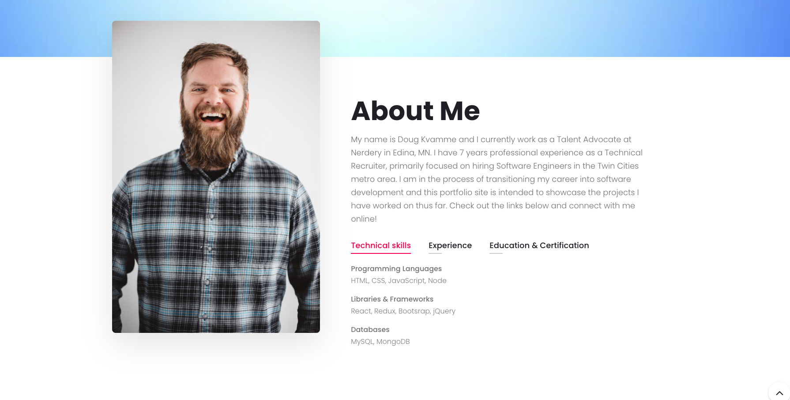

<h1 align="center">React Homework: Personal Portfolio</h1>

## Personal_Portfolio

- [Description](#description)
- [Installation](#installation)
- [Usage](#usage)
- [Contributing](#contributing)
- [Questions](#questions)

## Description

This is my personal portfolio built with React and deployed on Heroku.

Screenshot of the output:

## Installation

`npm i`

## Usage

Run the following command at the root of the directory and you will be able to view the local website at http://localhost:3000/

`npm run start`

The project was deployed on Heroku: https://dpkportfolio.herokuapp.com/

## Contributing

:octocat: [Doug Kvamme](https://github.com/kvadou)

## Questions

Contact me with any questions: [email](mailto:dougkvamme@gmail.com) , [GitHub](https://github.com/kvadou) 
